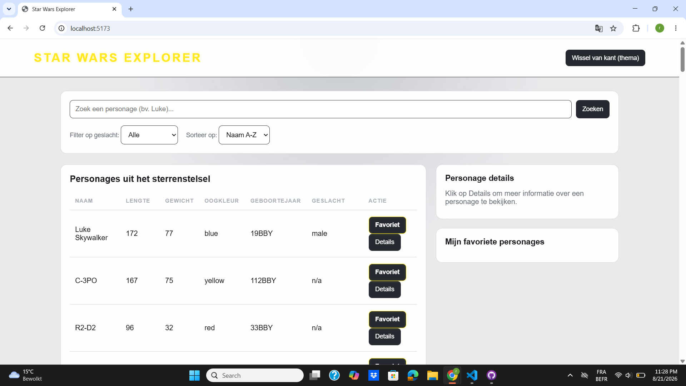
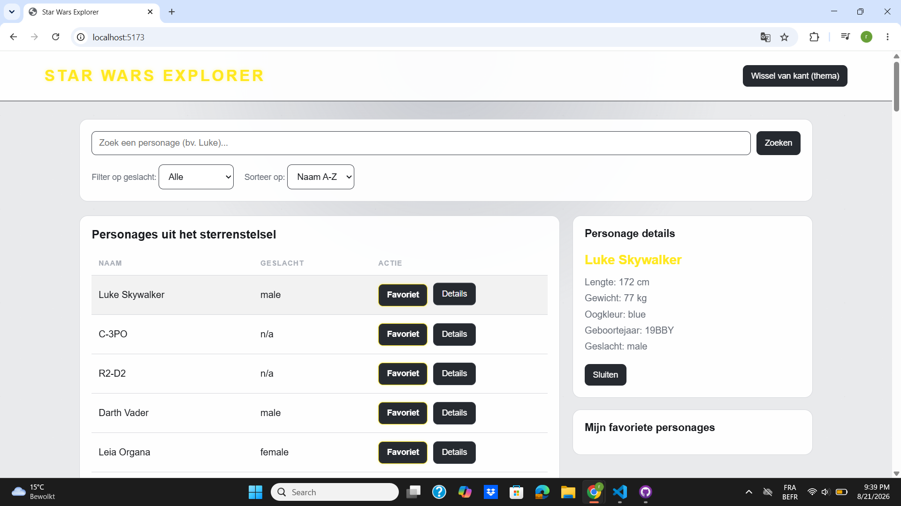
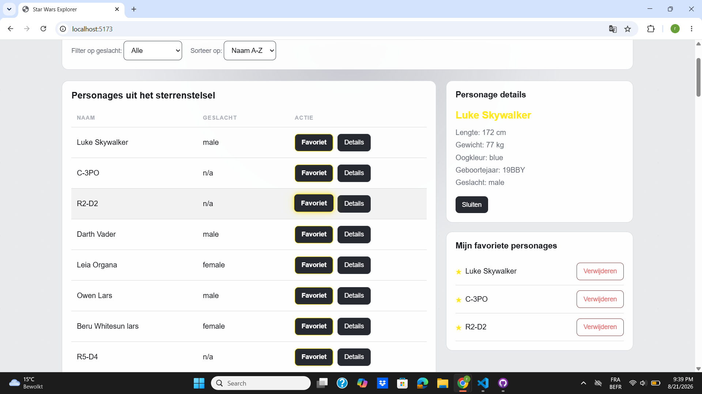
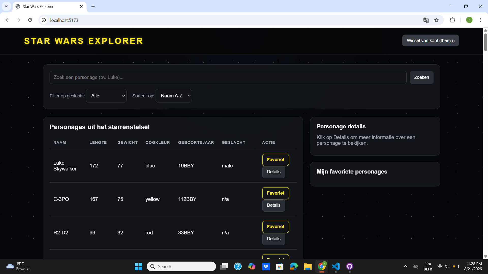

# Star Wars Explorer

## Beschrijving

Star Wars Explorer is een webapplicatie waarmee gebruikers verschillende Star Wars-personages kunnen bekijken.

De gegevens van de personages worden opgehaald via een API en worden daarna weergegeven op de website.

De gebruiker kan personages zoeken, filteren en sorteren. Er is ook een mogelijkheid om favoriete personages op te slaan en meer details van een personage te bekijken.

## Functionaliteiten

- Star Wars-personages ophalen via een API
- Personages weergeven
- Zoeken op naam
- Filteren op geslacht
- Sorteren van A-Z en Z-A
- Zoeken, filteren en sorteren combineren
- Details van een personage bekijken
- Personages toevoegen aan favorieten
- Personages verwijderen uit favorieten
- Favorieten bewaren met LocalStorage
- Light en dark theme
- Thema bewaren met LocalStorage
- Formuliervalidatie
- Foutmeldingen tonen
- Responsive design
- Animaties

## Technische uitleg

### API en Fetch
De gegevens van de Star Wars-personages worden opgehaald via een API. Hiervoor gebruik ik `fetch()`.

### Async / Await
Ik gebruik `async` en `await` om te wachten tot de gegevens van de API zijn opgehaald voordat ze op de website worden weergegeven.

### DOM Manipulatie
JavaScript wordt gebruikt om elementen op de pagina aan te passen. De personages worden bijvoorbeeld dynamisch toegevoegd aan de tabel.

### Class
Ik gebruik een `Character` class om van de gegevens uit de API Character-objecten te maken.

### LocalStorage
LocalStorage wordt gebruikt om de favorieten en het gekozen thema te bewaren. Hierdoor blijven deze gegevens bewaard wanneer de pagina opnieuw wordt geopend.

### Array methods
Ik gebruik verschillende array methods:
- `map()` om Character-objecten te maken.
- `filter()` voor de zoekfunctie, filters en het verwijderen van favorieten.
- `sort()` om de personages alfabetisch te sorteren.
- `some()` om te controleren of een personage al favoriet is.
- `forEach()` om personages op de pagina weer te geven.

### IntersectionObserver
Ik gebruik IntersectionObserver om een animatie toe te voegen wanneer personages zichtbaar worden op het scherm.

 ## Screenshots

### Personage details

### Favorieten

### Dark theme

## AI-gebruik

Tijdens dit project heb ik ChatGPT gebruikt als ondersteuning.

Ik heb AI vooral gebruikt voor:
- uitleg over JavaScript wanneer ik iets niet begreep;
- hulp bij het vinden en verbeteren van fouten in mijn code;
- uitleg over LocalStorage;
- hulp bij de favorieten en de detailweergave;
- hulp bij CSS en styling;
- uitleg over IntersectionObserver;
- hulp bij het schrijven en verbeteren van de README.

Ik heb de code tijdens het project stap voor stap toegevoegd en getest. Wanneer iets niet werkte, heb ik de code aangepast en opnieuw getest.

Ik kan de gebruikte functionaliteiten en de belangrijkste delen van mijn code uitleggen.

## AI-chatlog

Tijdens het project heb ik AI gebruikt als ondersteuning bij verschillende onderdelen.

De AI-chatlog wordt toegevoegd volgens de richtlijnen van de opdracht.

## Installatie

Om het project lokaal te starten:

1. Clone de repository.
2. Open het project in Visual Studio Code.
3. Installeer de nodige packages:

npm install

4. Start het project met:

npm run dev

5. Open de lokale URL die door Vite wordt weergegeven.

## Projectstructuur

Het project bestaat uit verschillende bestanden:

- `index.html` bevat de structuur van de website.
- `stijl.css` bevat de styling, animaties en responsive design.
- `app.js` bevat de belangrijkste logica van de applicatie.
- `api.js` wordt gebruikt om de gegevens van de API op te halen.
- `characterClass.js` bevat de Character class.
- `storage.js` bevat de functies voor LocalStorage.

## Gebruikte technologieën

- HTML
- CSS
- JavaScript
- Vite
- Fetch API
- LocalStorage
- Git en GitHub

## Data

De applicatie gebruikt een externe Star Wars API om gegevens van personages op te halen.

De opgehaalde gegevens worden omgezet naar Character-objecten voordat ze in de applicatie worden gebruikt.

Van een personage worden onder andere de volgende gegevens gebruikt:

- Naam
- Lengte
- Gewicht
- Oogkleur
- Geboortejaar
- Geslacht

De belangrijkste gegevens worden weergegeven in de lijst. Via de knop "Details" kan de gebruiker meer informatie over een personage bekijken.

## Foutafhandeling en validatie

De applicatie bevat verschillende controles om problemen op te vangen.

Als de gegevens niet correct kunnen worden opgehaald, krijgt de gebruiker een foutmelding.

Het zoekformulier bevat ook validatie. De gebruiker kan geen lege zoekopdracht uitvoeren.

Wanneer er geen personages overeenkomen met de zoekopdracht of filters, wordt er een melding weergegeven.

## Personalisatie

De gebruiker kan personages toevoegen aan een lijst met favorieten.

De favorieten worden opgeslagen in LocalStorage. Hierdoor blijven ze bewaard wanneer de pagina opnieuw wordt geladen.

Een personage kan niet meerdere keren aan de favorieten worden toegevoegd.

De gebruiker kan een favoriet ook opnieuw verwijderen.

Daarnaast kan de gebruiker wisselen tussen een licht en donker thema. De gekozen voorkeur wordt eveneens opgeslagen in LocalStorage.

## Responsive design

De website is responsive gemaakt met CSS.

Op een groot scherm worden de personages en de informatie aan de zijkant weergegeven.

Op kleinere schermen worden de onderdelen onder elkaar geplaatst zodat de website ook op een smartphone bruikbaar blijft.

## Animaties

De applicatie bevat verschillende kleine animaties.

De rijen met personages verschijnen met een animatie wanneer ze zichtbaar worden. Hiervoor wordt IntersectionObserver gebruikt.

Daarnaast bevatten verschillende knoppen hover-effecten met CSS transitions en transforms.

## Git en GitHub

Voor versiebeheer wordt Git gebruikt.

Tijdens de ontwikkeling werden verschillende commits gemaakt per functionaliteit. Hierdoor kan de ontwikkeling van het project gevolgd worden via de Git-geschiedenis.

Het project wordt bewaard in een GitHub repository.

## AI-gebruik

Tijdens dit project heb ik ChatGPT gebruikt als ondersteuning.

Ik heb AI onder andere gebruikt voor:

- uitleg wanneer ik bepaalde JavaScript-code niet begreep;
- hulp bij het zoeken naar fouten;
- hulp bij LocalStorage;
- hulp bij de favorieten;
- hulp bij de detailweergave;
- uitleg over IntersectionObserver;
- hulp bij CSS;
- hulp bij het verbeteren van de README.

De functionaliteiten werden tijdens de ontwikkeling stap voor stap toegevoegd en getest.

## AI-chatlog

Tijdens het project heb ik AI gebruikt als ondersteuning bij verschillende onderdelen.

De AI-chatlog wordt toegevoegd volgens de richtlijnen van de opdracht.

## Auteur

Dit project werd gemaakt voor het herexamen Web Advanced.
